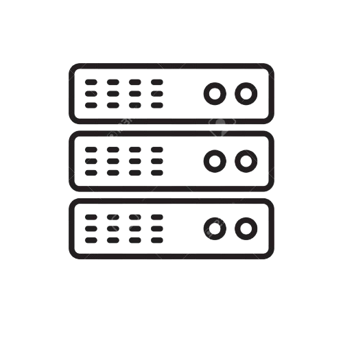

# What is a Network?

  

A **Computer Network** is a system where two or more devices (nodes) are linked together to share data, resources, and information. These networks can range from simple setups, like connecting two devices in your home, to massive global systems, like the Internet.  

> _"A computer network is a digital telecommunications network which allows nodes to share resources."_

---

## 🏗️ Building a Network

To build a network, you need both **hardware** and **software** components, along with a clear **network design**. Here's a breakdown:

### 🧱 1. Network Components (Hardware)
- Router  
- Switch  
- Firewall  
- Modem  
- Access Points  
- Cables (Ethernet, Fiber)  
- Servers  
- Clients (PCs, phones, IoT devices)

### 🧠 2. Network Design
- Topology  
- IP Addressing  
- Subnetting  
- VLANs

### 🛠️ 3. Configuration and Tools (Software)
- Operating Systems  
- DHCP Server  
- DNS Server  
- Network Monitoring Tools  
- Security Tools

### 🔐 4. Security and Access Control
- Authentication  
- Authorization  
- Encryption  
- Firewalls and IDS/IPS  
- Access Control Lists (ACLs)

### 🧪 5. Testing & Maintenance
- Network Performance Testing  
- Troubleshooting Tools (e.g., Ping, Traceroute)  
- Updates & Patch Management  
- Backup and Recovery

---

## 👥 Clients

  

A **Client** refers to a device (usually a computer, smartphone, or application) that **requests and receives services** from a server.  
It initiates communication by asking for data or resources.

**Examples:**  
- Web browsers like Google Chrome, Mozilla Firefox, or Safari  
- Email apps, cloud storage sync apps, etc.

---

## 🖥️ Servers

  

A **Server** is a remote computer or system that **provides data, resources, or services** to clients.  
It listens to incoming client requests, processes them, and responds with the required information.

- Can serve multiple clients simultaneously  
- Examples: Web server, Email server, File server, DNS server

---

## 🔄 Servers and Clients

- A **client** is a device that accesses a service made available by a **server**.  
- A **server** is a device that provides functions or services for **clients**.  
- ➕ The same device can act as a **client** in one context and a **server** in another.

---

Switches
Routers
Firewalls
Supplementary Materials
